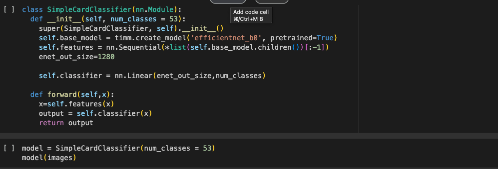

# Card Classifier

## 📁 Project Structure
- card_classifier.ipynb: Jupyter Notebook containing the full training pipeline, model architecture, and evaluation code.
- card_classifier.pkl: Serialized PyTorch model for inference.
- Dataset Source: [Kaggle - Cards Image Dataset (Classification)](https://www.kaggle.com/datasets/gpiosenka/cards-image-datasetclassification)

## 💻 Model Snippets

## 🚀 Features

- Built with PyTorch and torchvision  
- Image preprocessing and data augmentation  
- CNN-based model architecture  
- Training with validation and performance visualization  
- Model serialization using .pkl

## 🧠 Model Architecture

The model is a custom convolutional neural network (CNN) designed to classify card images. It includes:

- Convolutional layers  
- ReLU activations  
- Max pooling  
- Fully connected (linear) layers

Detailed architecture and training process can be found in the [notebook](./FirstPyTorch.ipynb).

## 📊 Dataset

The dataset includes high-quality images of playing cards and is sourced from Kaggle:

**[gpiosenka/cards-image-datasetclassification](https://www.kaggle.com/datasets/gpiosenka/cards-image-datasetclassification)**

Make sure to download and extract the dataset before running the notebook.

## 💾 How to Use

### 1. Clone the repository

bash
git clone https://github.com/yourusername/card-classifier.git
cd card-classifier

### 2. Install Dependencies
Make sure you have PyTorch and the required libraries installed. You can install dependencies via:
bash
pip install -r requirements.txt

### 3. Run the Notebook
Open the Jupyter Notebook to explore the model training and evaluation:
bash
jupyter notebook FirstPyTorch.ipynb

### 4. Inference using Saved Model
You can load the trained model from the .pkl file for inference:
python
import torch

model = torch.load('card_classifier.pkl')
model.eval()

# Predict on a new image...

### 📌 Future Enhancements
- Integrate real-time detection using OpenCV

- Export to ONNX or TorchScript for mobile/web inference

- Build a web UI to test the model live

### 🪪 License
MIT License. Feel free to use and contribute!
